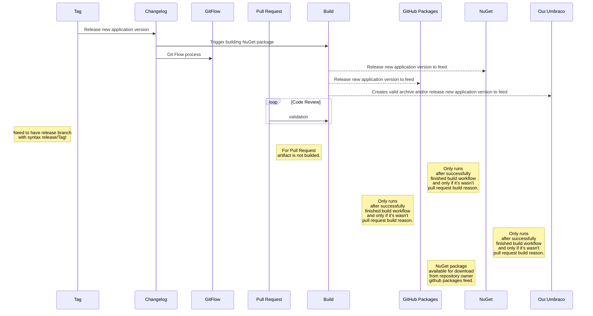

# Deployments
## Deployment process
Follow the general standards with [GitFlow](../.github/workflows/gitflow.yml) and [Changelog](../.github/workflows/changelog.yml) pipeline:

1. Create a **release branch** for the release number (e.g. _release/2.9.11_) and push it to the origin.
1. Perform the adjustments on the branch if needed e.g. last fixes related with the **release**.
1. Add an **annotated tag** with the release number (e.g. _2.9.11_) on the release branch and push tag to the origin.
1. The above step should trigger the **automation on Github** and regenerate changelog + move the tag to the master branch.
1. After that it will create and publish NuGet (based on nuspec files) package for feeds:
   1. GitHub Packages

## Workflows

 1. Changelog workflow - [changelog.yml](../.github/workflows/changelog.yml)

    Main entry point for releasing new application version triggered by tag push. It's generate changelog base on git commits (more info: https://commitlint.js.org) and move tag to committed changelog commit.

 1. GitFlow workflow - [gitflow.yml](../.github/workflows/gitflow.yml)

    GitFlow process triggered after successfully finished changelog workflow. It synchronize and cleans repository branches based on tag:
     1. It synchronize master
     1. It synchronize develop
     1. It removes release branch

 1. Build workflow - [build.yml](../.github/workflows/build.yml)

    Build process triggered:
        1. Build for Pull Request - only build solution for code review process by pull request event with status of build.
        1. Build for Release - it's triggered after changelog process is done (releasing new version). The result of it is builded artifact with all NuGet files attached to build pipeline and ready to be process by `release-*.yml` workflows.

 1. (NuGet) NuGet workflow - [release_nuget.yml](../.github/workflows/release_nuget.yml)
    This workflow is triggered after successfully finished build workflow and only if it's wasn't pull request build reason.
    It consumes latest nuget artifact package that is builded NuGet file and push it to NuGet feed.

 1. (NuGet) GitHub Packages workflow - [release_github.yml](../.github/workflows/release_github.yml)
    This workflow is triggered after successfully finished build workflow and only if it's wasn't pull request build reason.
    It consumes latest nuget artifact package that is builded NuGet file and push it to GitHub Packages feed (repository owner packages feed).

 1. (Umbraco) Our.Umbraco workflow - [release_umbraco.yml](../.github/workflows/release_umbraco.yml)
    This workflow is triggered after successfully finished build workflow and only if it's wasn't pull request build reason.
    It consumes latest build artifact package that is builded solution binaries and content files and creates Our.Umbraco archive artifact and/or push it to Our.Umbraco feed.
